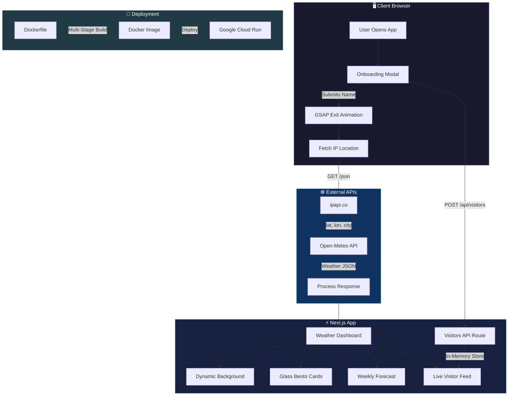
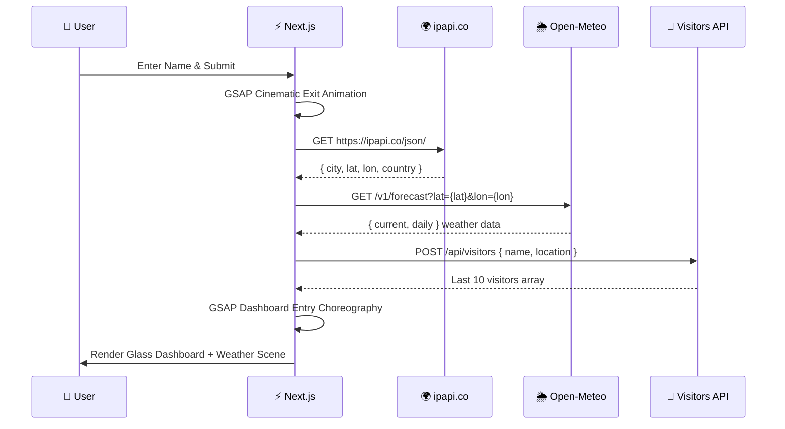
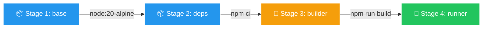

<div align="center">

# 🌦️ Guess Ma Weather

**A hyper-modern, cinematic weather web application with Apple-grade glassmorphism, GSAP choreography, and real-time IP-based location detection.**

[](https://nextjs.org/)
[](https://react.dev/)
[](https://www.typescriptlang.org/)
[](https://tailwindcss.com/)
[](https://gsap.com/)
[](https://www.docker.com/)

</div>

---

## 📖 Table of Contents

- [Overview](#-overview)
- [Architecture](#-architecture)
- [Tech Stack](#-tech-stack)
- [Features](#-features)
- [APIs & Data Sources](#-apis--data-sources)
- [Iconography](#-iconography)
- [Getting Started](#-getting-started)
- [Docker & DevOps](#-docker--devops)
- [Project Structure](#-project-structure)
- [License](#-license)

---

## 🌟 Overview

**Guess Ma Weather** is a flagship-quality weather dashboard built as a Next.js 16 web application. It automatically detects the user's location via their public IP address, fetches hyper-local weather data, and presents it through a stunning, Apple Vision Pro-inspired glassmorphism interface with world-class GSAP animations.

The app is containerized with Docker and optimized for deployment on **Google Cloud Run** for seamless, scalable hosting.

### Key Highlights

- 🎭 **Cinematic GSAP Transitions** — Temperature counter animations, elastic spring card reveals, and 3D perspective cascades
- 🪟 **Apple-Grade Glassmorphism** — 50px frosted blur with 200% saturation, directional light borders, and layered depth
- 🌧️ **Dynamic Weather Scenes** — CSS-driven rain, snow, stars, fog, and lightning rendered in real-time behind the UI
- 📱 **Mobile-First, Web-App Ready** — Feels native on phones with haptic feedback (`navigator.vibrate`), scales beautifully to desktop bento layouts
- 🔒 **Zero API Keys Required** — Uses completely free, open-source weather and geolocation APIs

---

## 🏗️ Architecture



### Data Flow



---

## ⚙️ Tech Stack

| Category | Technology | Purpose |
|----------|-----------|---------|
| **Framework** |  | App Router, React 19, SSR/SSG |
| **Language** |  | Type-safe development |
| **Styling** |  | Utility-first CSS framework |
| **Animation** |  | Cinematic timeline choreography |
| **Animation** |  | Declarative layout transitions |
| **Icons** |  | Dynamic SVG weather icons |
| **Date Utils** |  | Lightweight date formatting |
| **Container** |  | Multi-stage production builds |
| **Cloud** |  | Serverless container hosting |

---

## ✨ Features

### 🎭 Onboarding Experience
- **Glassmorphism Modal** with frosted blur over an animated mesh gradient background.
- Persistent sessions via `localStorage` (10-minute weather cache) to minimize extraneous API calls.
- Name capture with XSS sanitization built into the API layer.

### 🌡️ Weather Dashboard
- **Massive Temperature Display** — 14rem hero typography with GSAP counter elastic animations.
- **Dynamic Condition Labels** — Beautiful text mapping based on real-time WMO weather codes.
- **Bento Box Metrics** — Wind Speed, Humidity, and Visibility presented in premium glass panels.
- **5-Day Forecast** — Individual glass cards with per-day icons and temperatures floating into view.

### 🌧️ Dynamic Weather Backgrounds
Real-time CSS-animated weather scenes rendered behind the glass UI, fully GPU-composited (`will-change: transform`).

### 🪟 Apple-Grade Glassmorphism
- `backdrop-filter: blur(50px) saturate(200%)` for realistic frosted glass.
- Directional light borders simulating physical glass thickness.
- Separate `.glass-panel` (light) and `.glass-panel-dark` (dark) variants.

### 🌓 Light & Dark Mode
- Full Dark/Light mode theme toggle support with adaptive apple-mesh gradients.
- **Dark Mode**: Deep navy gradient with dark glass panels.
- **Light Mode**: Weather-adaptive gradient backgrounds (azure for sunny, silver for cloudy, etc.).

### 📳 Haptic Feedback
- `navigator.vibrate()` triggers on interactions (button presses, card taps, theme toggles), giving a true native app feel on Android devices.

### 👥 Live Visitor Feed
- In-memory global store queue with IP rate limiting and deduplication.
- Displays visitor name (truncated and escaped), location, and 12-hour format timestamps.

---

## 🌐 APIs & Data Sources

### 🌦️ Open-Meteo — Weather Data

> **URL**: `https://api.open-meteo.com/v1/forecast`

We are using **Open-Meteo**, a robust, **free, open-source API** that requires zero authentication or API keys. It delivers incredibly fast real-time conditions and highly accurate 7-day forecast data globally.

### 🌍 ipapi.co — IP Geolocation

> **URL**: `https://ipapi.co/json/`

This API translates the user's HTTP request IP address into physical latitude and longitude coordinates, allowing us to supply Open-Meteo with hyper-local coordinates instantaneously without prompting for browser GPS permissions.

---

## 🎨 Iconography

We utilize **[Lucide React](https://lucide.dev)** for dynamic SVG iconography. Lucide icons are extremely lightweight, allow us to control stroke width and opacity dynamically through CSS/Tailwind, and perfectly fit the premium Apple-like design aesthetic.

---

## 🚀 Getting Started

### Prerequisites

- **Node.js** ≥ 20.x
- **npm** ≥ 9.x

### Quickstart

```bash
# Clone the repository
git clone https://github.com/thezaynahmed/GuessMaWeather.git
cd GuessMaWeather

# Install dependencies
npm install

# Start the development server
npm run dev
```

The app will be available at `http://localhost:3000`.

---

## 🐳 Docker & DevOps

This repository includes a highly-optimized, **production-ready multi-stage Dockerfile** designed specifically for Next.js 15+ standalone outputs and platforms like Google Cloud Run or Kubernetes.

### Multi-Stage Build Pipeline



### Security & Optimization Features
- **Standalone Output:** Next.js traces the `node_modules` and outputs a micro-bundle, dropping image size to **~150MB**.
- **Non-Root User:** Hardened container runs as `nextjs` (UID 1001) rather than root.
- **Docker HEALTHCHECK:** Built-in `wget` HTTP probe executing every 30s ensures container orchestrators recognize process stability.
- **Clean Context:** Excludes `.git`, `.github`, and `.env` via strict `.dockerignore` policies.

### Local Container Build

```bash
# Build the optimized production image
docker build -t guessmaweather .

# Run locally on port 3000
docker run -p 3000:3000 guessmaweather
```

---

## 📁 Project Structure

```
GuessMaWeather/
├── src/
│   └── app/
│       ├── api/
│       │   └── visitors/
│       │       └── route.ts          # Last 10 visitors API (GET/POST / Rate Limited)
│       ├── globals.css               # Glassmorphism, weather animations, mesh gradients
│       ├── layout.tsx                # Root layout with metadata & viewport
│       └── page.tsx                  # Main app (onboarding, dashboard, GSAP, local cache)
├── public/                           # Static assets
├── Dockerfile                        # Multi-stage production build (HEALTHCHECK enabled)
├── .dockerignore                     # Docker exclusions
├── next.config.ts                    # Standalone output configuration
├── tailwind.config.ts                # Tailwind CSS configuration
├── tsconfig.json                     # TypeScript configuration
├── package.json                      # Dependencies & scripts
└── README.md                         # This file
```

---

## 📄 License

This project is open-source and available under the [MIT License](LICENSE).

---

<div align="center">

**Built with ❤️ using Next.js, GSAP, Framer Motion, and Apple-grade Glassmorphism.**

</div>
