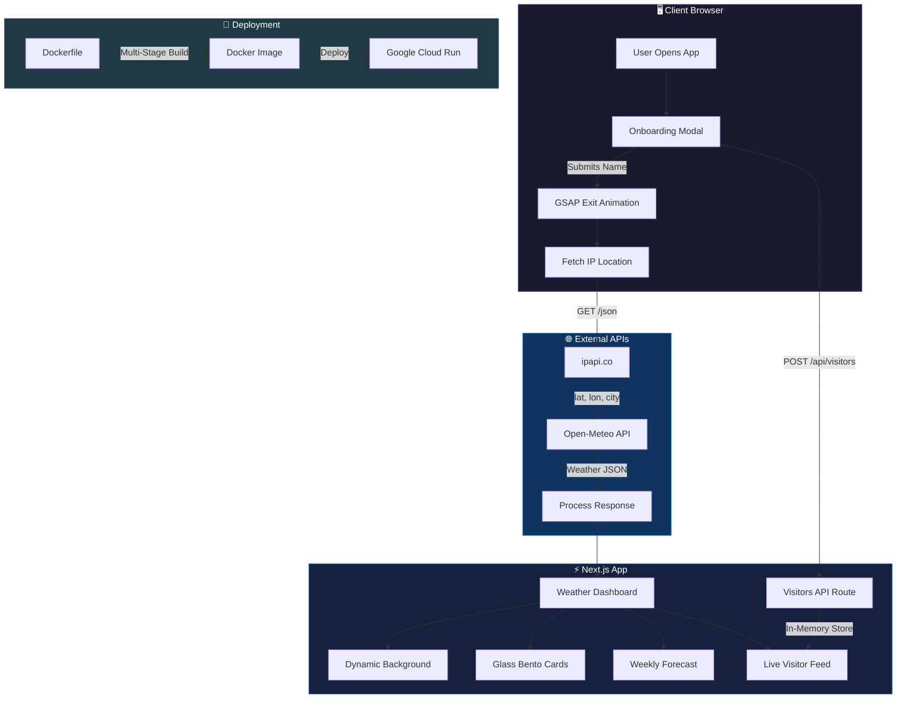
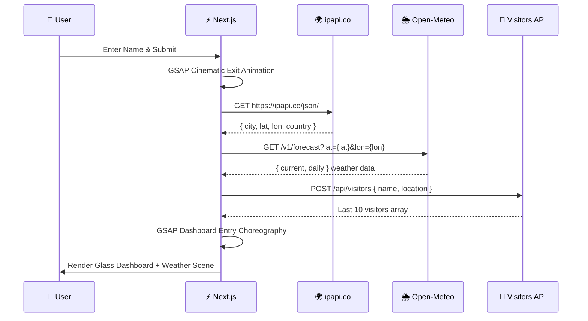
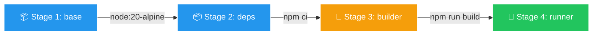

<


</div>

---

## 📖 Table of Contents

- [Overview](#-overview)
- [Architecture](#-architecture)
- [Tech Stack](#-tech-stack)
- [Features](#-features)
- [APIs & Data Sources](#-apis--data-sources)
- [Iconography](#-iconography)
- [Getting Started](#-getting-started)
- [Docker & DevOps](#-docker--devops)
- [Project Structure](#-project-structure)
- [License](#-license)

---

## 🌟 Overview

**Guess Ma Weather** is a flagship-quality weather dashboard built as a Next.js 16 web application. It automatically detects the user's location via their public IP address, fetches hyper-local weather data, and presents it through a stunning, Apple Vision Pro-inspired glassmorphism interface with world-class GSAP animations.

The app is containerized with Docker and optimized for deployment on **Google Cloud Run** for seamless, scalable hosting.

### Key Highlights

- 🎭 **Cinematic GSAP Transitions** — Temperature counter animations, elastic spring card reveals, and 3D perspective cascades
- 🪟 **Apple-Grade Glassmorphism** — 50px frosted blur with 200% saturation, directional light borders, and layered depth
- 🌧️ **Dynamic Weather Scenes** — CSS-driven rain, snow, stars, fog, and lightning rendered in real-time behind the UI
- 📱 **Mobile-First, Web-App Ready** — Feels native on phones with haptic feedback (`navigator.vibrate`), scales beautifully to desktop bento layouts
- 🔒 **Zero API Keys Required** — Uses completely free, open-source weather and geolocation APIs

---

## 🏗️ Architecture



### Data Flow



---

## ⚙️ Tech Stack

| Category | Technology | Purpose |
|----------|-----------|---------|
| **Framework** |  | App Router, React 19, SSR/SSG |
| **Language** |  | Type-safe development |
| **Styling** |  | Utility-first CSS framework |
| **Animation** |  | Cinematic timeline choreography |
| **Animation** |  | Declarative layout transitions |
| **Icons** |  | Dynamic SVG weather icons |
| **Date Utils** |  | Lightweight date formatting |
| **Container** |  | Multi-stage production builds |
| **Cloud** |  | Serverless container hosting |

---

## ✨ Features

### 🎭 Onboarding Experience
- Glassmorphism modal with frosted blur over animated mesh gradient background
- Name capture with disclaimer about the Live Visitors feed
- Persistent sessions via `localStorage` — refreshing keeps you logged in

### 🌡️ Weather Dashboard
- **Massive Temperature Display** — 16rem hero typography with GSAP counter animation from 0
- **Dynamic Condition Labels** — "Sunny", "Clear", "Cloudy", "Rain", "Snow", "Thunderstorm" mapped from WMO codes
- **Daily Summary Tidbits** — Contextual weather advice (e.g., "Don't forget your umbrella!")
- **Bento Box Metrics** — Wind Speed, Humidity, and Visibility in a glass panel
- **5-Day Forecast** — Individual glass cards with per-day icons and temperatures

### 🌧️ Dynamic Weather Backgrounds
Real-time CSS-animated weather scenes rendered behind the glass UI:

| Condition | Visual Effect |
|-----------|--------------|
| ☀️ Clear Day | Clean gradient sky |
| 🌙 Clear Night | Twinkling animated stars |
| ☁️ Cloudy/Fog | Drifting translucent cloud blobs |
| 🌧️ Rain/Showers | Falling rain streaks |
| ❄️ Snow | Softly drifting snowflakes with glow |
| ⛈️ Thunderstorm | Heavy rain + white lightning flashes |

### 🪟 Apple-Grade Glassmorphism
- `backdrop-filter: blur(50px) saturate(200%)` for realistic frosted glass
- Directional light borders (brighter top-left) simulating physical glass thickness
- Separate `.glass-panel` (light) and `.glass-panel-dark` (dark) variants
- All glass panels react to the gradient behind them

### 🌓 Light & Dark Mode
- Toggle via the Sun/Moon button in the navigation bar
- **Dark Mode**: Deep navy gradient with dark glass panels
- **Light Mode**: Weather-adaptive gradient backgrounds (azure for sunny, silver for cloudy, etc.)
- Theme preference persisted to `localStorage`

### 📳 Haptic Feedback
- `navigator.vibrate()` API triggers on interactions (button presses, card taps, theme toggles)
- Designed to feel like a native iOS app on supported Android devices

### 👥 Live Visitor Feed
- Server-side in-memory store for the last 10 visitors
- Displays visitor name, location, and timestamp
- Real-time green "Live" indicator with ping animation

---

## 🌐 APIs & Data Sources

### 🌦️ Open-Meteo — Weather Data

> **URL**: `https://api.open-meteo.com/v1/forecast`

Open-Meteo is a fantastic, **free, open-source** weather API that doesn't require API keys or complex authentication, making it incredibly fast and reliable for fetching both real-time conditions and 7-day forecast data.

**Endpoint Used:**
```
GET /v1/forecast
  ?latitude={lat}
  &longitude={lon}
  &current=temperature_2m,weather_code,wind_speed_10m,relative_humidity_2m,visibility,is_day
  &daily=weather_code,temperature_2m_max,temperature_2m_min
  &timezone=auto
```

**Response Data:**
| Field | Description |
|-------|-------------|
| `current.temperature_2m` | Current temperature in °C |
| `current.weather_code` | WMO weather interpretation code |
| `current.wind_speed_10m` | Wind speed at 10m height (km/h) |
| `current.relative_humidity_2m` | Relative humidity (%) |
| `current.visibility` | Visibility distance (meters) |
| `current.is_day` | 1 = daytime, 0 = nighttime |
| `daily.temperature_2m_max/min` | Daily high/low temperatures |
| `daily.weather_code` | Daily weather condition codes |

### 🌍 ipapi.co — IP Geolocation

> **URL**: `https://ipapi.co/json/`

This API translates the user's public IP address into physical latitude and longitude coordinates, city name, region, and country — which are then handed to Open-Meteo for hyper-local weather fetching.

**Response Data:**
| Field | Description |
|-------|-------------|
| `city` | User's city (e.g., "Brampton") |
| `region` | State/Province |
| `country_name` | Country (e.g., "Canada") |
| `latitude` | Geographic latitude |
| `longitude` | Geographic longitude |

---

## 🎨 Iconography

We use **[Lucide React](https://lucide.dev)** (`lucide-react`) for all iconography. Lucide icons are extremely lightweight, allow us to control stroke width and opacity dynamically through CSS/Tailwind, and perfectly fit the premium Apple-like design aesthetic.

Icons are dynamically mapped to WMO weather codes:

| Icon Component | Usage | Weather Codes |
|---------------|-------|---------------|
| `Sun` / `SunMedium` | Clear, sunny days | 0 (daytime) |
| `Moon` / `MoonStar` | Clear nights + theme toggle | 0 (nighttime) |
| `Cloud` | Cloudy, overcast, snowy, foggy | 1–3, 45–48, 71–77 |
| `CloudRain` | Rain and passing showers | 51–67, 80–82 |
| `CloudLightning` | Severe thunderstorms | 95–99 |
| `Wind` | Wind speed metric | Bento card |
| `Droplets` | Humidity metric | Bento card |
| `Eye` | Visibility metric | Bento card |
| `LogOut` | Session reset button | Navigation |
| `Clock` | Visitor timestamps | Live feed |

---

## 🚀 Getting Started

### Prerequisites

- **Node.js** ≥ 20.x
- **npm** ≥ 9.x

### Installation

```bash
# Clone the repository
git clone https://github.com/yourusername/guessmaweather.git
cd guessmaweather

# Install dependencies
npm install

# Start the development server
npm run dev
```

The app will be available at `http://localhost:3000`.

### Build for Production

```bash
npm run build
npm start
```

---

## 🐳 Docker & DevOps

### Dockerfile

The project includes a **production-ready, multi-stage Dockerfile** optimized for Next.js deployment on Google Cloud Run:



| Stage | Purpose | Key Actions |
|-------|---------|-------------|
| **base** | Alpine Node.js image | Minimal footprint |
| **deps** | Dependency installation | `npm ci` for deterministic installs |
| **builder** | Application build | `next build` with standalone output |
| **runner** | Production runtime | Copies only standalone output traces |

### Build & Run with Docker

```bash
# Build the image
docker build -t guessmaweather .

# Run locally
docker run -p 3000:3000 guessmaweather
```

### Deploy to Google Cloud Run

```bash
# Authenticate with GCP
gcloud auth login

# Build and push to Container Registry
gcloud builds submit --tag gcr.io/YOUR_PROJECT_ID/guessmaweather

# Deploy to Cloud Run
gcloud run deploy guessmaweather \
  --image gcr.io/YOUR_PROJECT_ID/guessmaweather \
  --platform managed \
  --region us-central1 \
  --allow-unauthenticated \
  --port 3000
```

### .dockerignore

The `.dockerignore` file explicitly excludes sensitive and unnecessary files:

```
node_modules    # Dependencies rebuilt inside container
.next           # Build output regenerated
.env*           # Environment secrets never shipped
.git            # Version control history
```

### Key Configuration

The `next.config.ts` is set with `output: 'standalone'` which enables Next.js to automatically trace and bundle only the files needed for production, resulting in Docker images as small as **~150MB**.

---

## 📁 Project Structure

```
guessmaweather/
├── src/
│   └── app/
│       ├── api/
│       │   └── visitors/
│       │       └── route.ts          # Last 10 visitors API (GET/POST)
│       ├── globals.css               # Glassmorphism, weather animations, mesh gradients
│       ├── layout.tsx                # Root layout with metadata & viewport
│       └── page.tsx                  # Main app (onboarding, dashboard, GSAP, weather scenes)
├── public/                           # Static assets
├── Dockerfile                        # Multi-stage production build
├── .dockerignore                     # Docker exclusions
├── next.config.ts                    # Standalone output configuration
├── tailwind.config.ts                # Tailwind CSS configuration
├── tsconfig.json                     # TypeScript configuration
├── package.json                      # Dependencies & scripts
└── README.md                         # This file
```

---

## 📄 License

This project is open source and available under the [MIT License](LICENSE).

---

<div align="center">

**Built with ❤️ using Next.js, GSAP, Framer Motion, and Apple-grade Glassmorphism**


</div>
]]>
